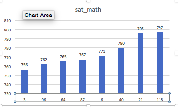
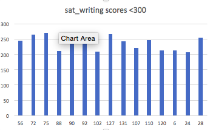
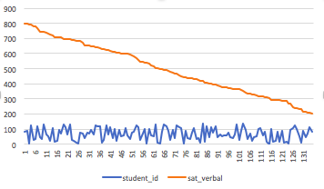
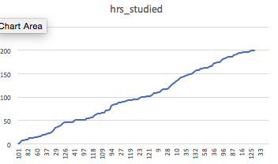
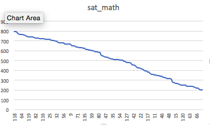

# ICA4-MANDY

--which student(student_id) has the sat_math scores under 750? 
```SQL
SELECT student_id, sat_math
FROM datasets.sat_scores 
WHERE sat_math > 750 
ORDER BY sat_math ASC
```


--which students(student_id) has the sat_writing scores below 300? 
```SQL
SELECT student_id, sat_writing 
FROM datasets.sat_scores
WHERE sat_writing < 300
ORDER BY sat_scores ASC 
```

 

--which students has the highest sat_verbal? 
```SQL
SELECT student_id, sat_verbal
FROM datasets.sat_scores
ORDER BY sat_verbal DESC
```



--rank the student from lowest to highest by hrs_studied 
```SQL 
SELECT student_id, hrs_studied
FROM datasets.sat_scores 
ORDER BY hrs_studied ASC 
```



--rank the student from highest to lowest by sat_math?
```SQL
SELECT student_id, sat_math
FROM datasets.sat_scores 
ORDER BY sat_math DESC
```



